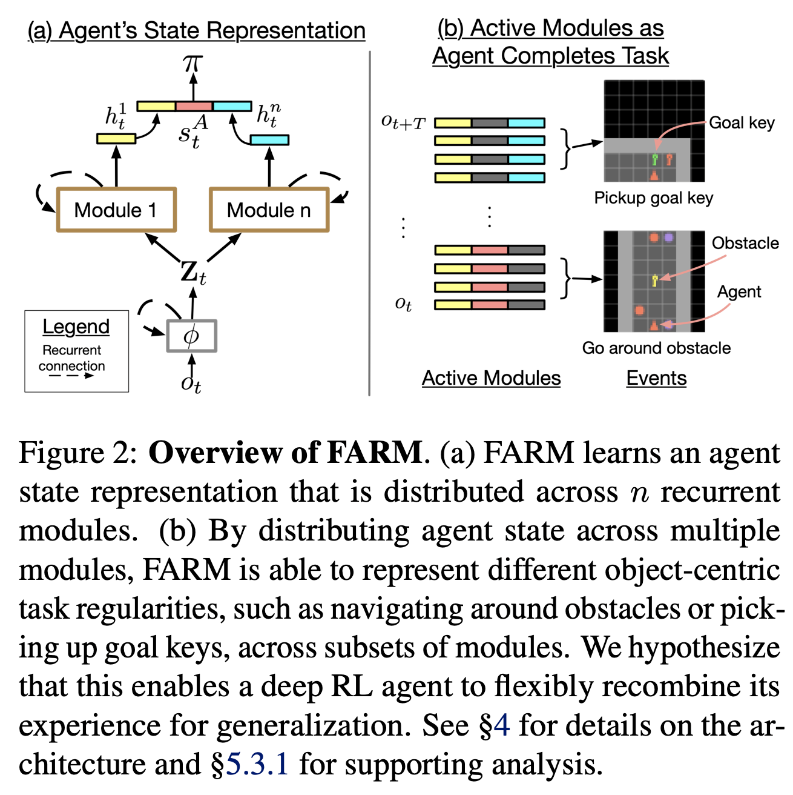

# FARM
Official codebase for [Feature-Attending Recurrent Modules (FARM)](https://arxiv.org/abs/2112.08369?context=cs.AI) with an RL Agent based on the [ACME](https://github.com/deepmind/acme) codebase.




# Install
```
bash setup.sh
```
**Important note: Place conda env inside library path**
```
export LD_LIBRARY_PATH:=$(LD_LIBRARY_PATH):$(HOME)/miniconda3/envs/farm/lib/
```
Why? An ACME library will give a complaint similar to the following:
```
ImportError: libpython3.9.so.1.0: cannot open shared object file: No such file or directory
```

See Makefile for an example.

# Run FARM w/ R2D2 on BSUITE

## Synchronous
```
make train_synch
```


## Asynchronous
```
make train_asynch
```

Notes:
- this runs multiple actors
- actor/evaluator/learner all run in parallel thanks to ACME


## Cite

If you make use of this code in your own work, please cite our paper:

````
```
@article{carvalho2021feature,
  title={Feature-Attending Recurrent Modules for Generalizing Object-Centric Behavior},
  author={Carvalho, Wilka and Lampinen, Andrew and Nikiforou, Kyriacos and Hill, Felix and Shanahan, Murray},
  journal={arXiv preprint arXiv:2112.08369},
  year={2021}
}```
````